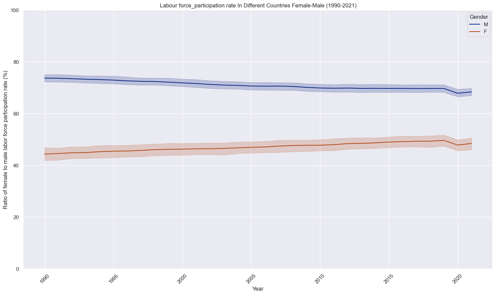
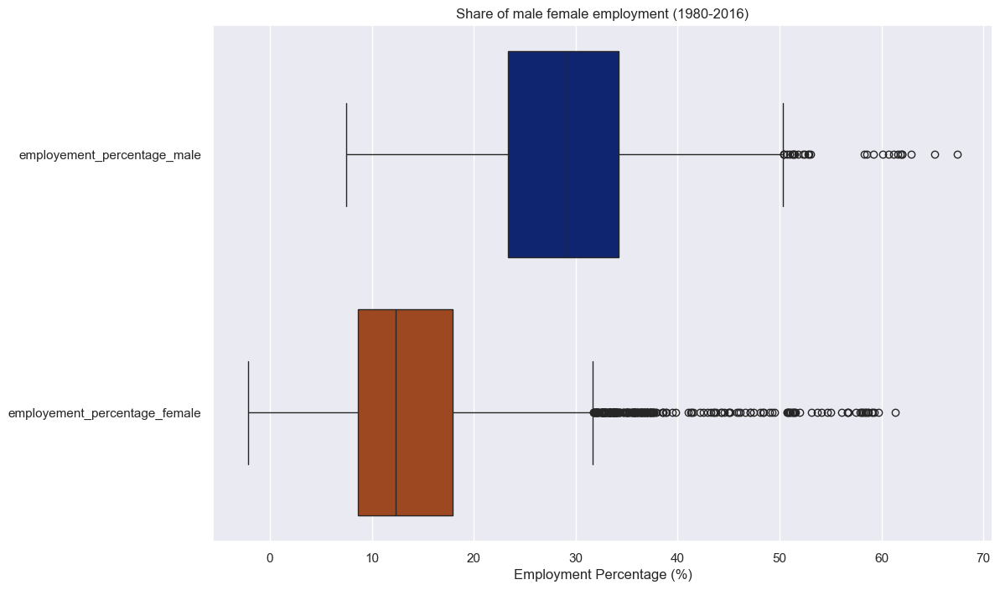
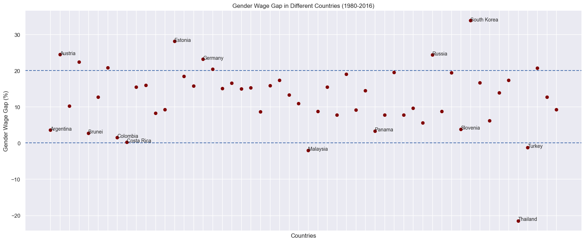
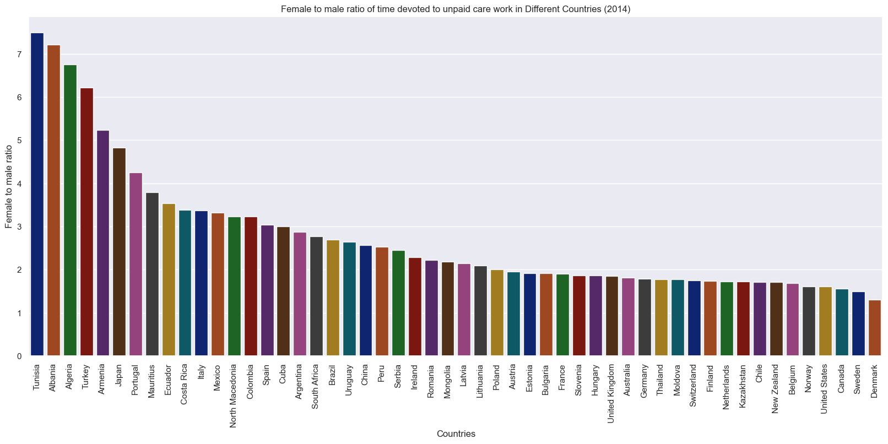
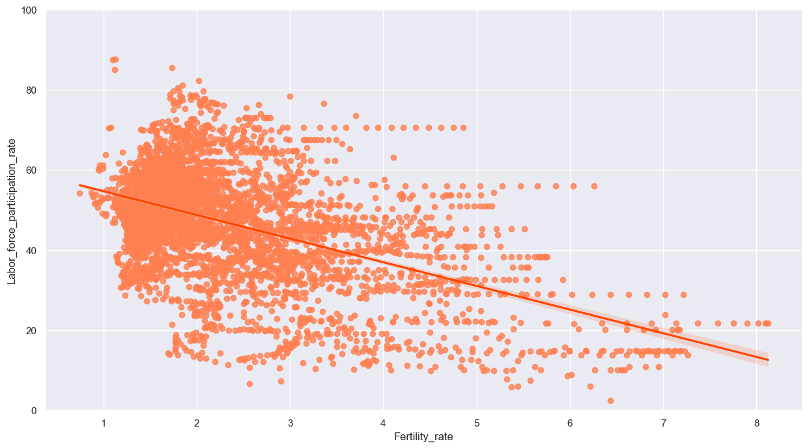
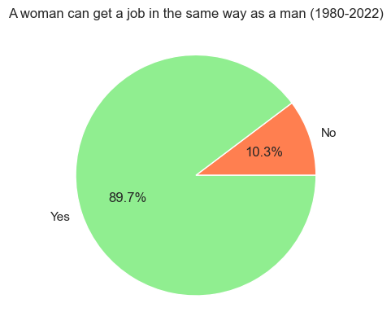

# Why Women's Labor Force Participation is Lower Than Men's

## Purpose
- The purpose of this analysis is to scrutinize the labor force participation of women in comparison to men using data-driven approaches. 
- It involves an examination of the disparity between genders in labor force participation and employment rates, followed by an exploration of the underlying reasons for this gap.

## Finalist in  Women In Datathon (Up School & Bitexen)

🎉 I am proud to announce that my project was selected as one of the final 6 projects in Women in Datathon! 

## Analysis Method 
Exploratory Data Analysis (EDA) carried out:

1. **Handling Missing Values:**
   - Missing values were filled through a two different approaches:
     - Utilizing regression analysis to predict missing values based on other variables.
     - Imputing missing values by examining similar data points within the dataset.

2. **Statistical Examination:**
   - Basic statistical measures, such as mean, median, and standard deviation, were calculated to gain insights into the central tendencies and distributions of the data.

3. **Data Visualization:**
   - Extensive data visualizations were employed to explore the dataset.
   - Visualizations included line plots, box plots, bar plots and heat map among others.

By combining rigorous statistical analysis with intuitive data visualizations, I was able to derive meaningful insights.

The analysis has two steps :
1. [Comparing Female - Male Labor Force Participation and Employment](labor_force_participation.ipynb)
2. [Why Women Participate in the Labor Force Less Than Men](why_women_participate_labor_force_less_than_men.ipynb)

## Analysis Constraints
- Focus on employment and labor force participation discrepancies between men and women
- Examination of factors contributing to women's lower participation in the labor force
- Comparative analysis of countries with high and very high Human Development Index (HDI) from the 1980s to present

## Data
For two step analysis the datasets that are used noted down below. I added data to strengthen the analysis.

#### Female - Male Labor Force Participation and Employment Datasets:
- Labor Participation Rates
- Labor Force Participation (Female and Male)
- female employment to population (Added dataset) (https://ourworldindata.org/grapher/female-employment-to-population-ratio)
- share of male vs female employment (Added dataset)(https://ourworldindata.org/grapher/share-of-male-vs-female-employment-in-industry)

#### Why Women Participate in the Labor Force Less Than Men Datasets:
- Gender gap-wage
- share-of-women-in-top-income-groups
- unpaid-care-work
- fertility labor force
- woman can take the same jobs (Added dataset) (https://ourworldindata.org/grapher/women-can-take-the-same-jobs-as-men)

For constraining data I added:
- human-development-index-(hdi)-by-country (https://worldpopulationreview.com/country-rankings/hdi-by-country)

# Results

Based on the analysis conducted, several key insights have emerged:

- Gender Disparity in Labor Force Participation: Across countries with diverse HDI levels, female participation in the labor force consistently lags behind that of males, despite gradual improvements over time.

- Gender Inequality in Employment: Female employment rates remain inferior to those of males, indicating systemic gender biases in hiring practices favoring men and resulting in a significant proportion of women being unemployed.

- Wage Disparities: Analysis of income datasets reveals unequal pay for equal work, reflecting pervasive gender wage gaps and highlighting the challenges faced by women in securing fair employment opportunities.

- Cultural Norms and Unpaid Care Work: Women are disproportionately burdened with unpaid care work, perpetuating societal expectations that prioritize household responsibilities over paid employment and exacerbating gender disparities in the labor force.

- Fertility and Labor Force Participation: Negative correlations between fertility rates and female labor force participation suggest that family obligations influence women's employment decisions, further impacting gender equality in the workforce.

- Cultural Barriers: Despite progress, cultural norms persist in some regions, including Turkey, where certain jobs are deemed unsuitable for women, discouraging their pursuit of diverse career paths and perpetuating gender inequalities.

- In summary, gender inequalities, cultural norms, and the burden of unpaid care work collectively contribute to the underrepresentation of women in the workforce compared to men. Addressing these systemic issues is crucial for achieving gender parity in employment opportunities.

## Contributing
Feel free to contribute by opening issues or submitting pull requests. 

## Contact
For questions or feedback, contact aslihanyoldas24@gmail.com
